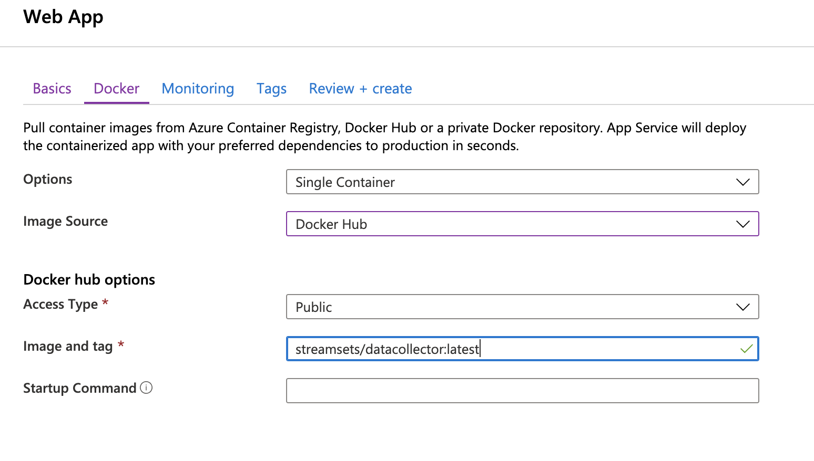

**StreamSets DataCollector:**

**Create StreamSets DataCollector as Azure App Service**

In this tutorial, we will explain how StreamSets DataCollector (SDC) is deployed as an Azure App Service while persisting the pipelines over SDC restarts. 

To recap, other way to install SDC are:

*   Tarball
*   RPM Package
*   Docker
*   AWS marketplace
*   Azure marketplace

Although, Azure App Services persist the state of an app during execution mode, they do not store the state over a restart. Meaning, after every single SDC restart all pipelines will be lost each time. 

Due to the stateless nature of App Services, relevant directories must be stored outside of the App Service while being permanently accessible by the App.

For SDC that will require to create external containers and mount them to the paths that need to be stateful.

In SDC (at least this folder):

/data

Other folders can be also mounted to Azure containers.

This approach will allow to keep and persist pipelines over multiple restarts and across the entire lifetime of the App Service.

1. Create SDC as App Service
    1. **Add**.
{ width=200px}
    2. After adding app service name, resource group, app service plan click on **Next**.
    3. Choose for Image Source = Docker Hub

        Image and tag = streamsets/datacollector:latest. Alternatively, choose your own derived Docker DataCollector image.

{ width=200px}
    4. Complete the creation of the App Service.

2. Create Azure storage container
    1. Go to your storage account and add a container.

{ width=200px}

   2. Add the container name and choose public access-type = Blob.

{ width=200px}

3. Mount SDC paths to Azure Containers.
  1. Go to the App Service -> **Configuration** -> **Path mappings**.

{ width=200px}

  2. Add “New Azure Storage Mount”.
{ width=200px}

3. Click **Ok** .

{ width=200px}

4. Restart App Service.

**Note:**
_In case, you need to install in the SDC App Service additional SDCs libraries (connectors, processors etc.), we recommend to create a custom SDC docker image containing the additional SDCs libraries. Then, deploy the custom SDC docker image as an Azure App Service and mount /data, /log and other folders to the Azure Containers._

**Conclusion**

This instruction highlighted how to create StreamSets DataCollector as an Azure App Service and persist pipelines over multiple restarts.

